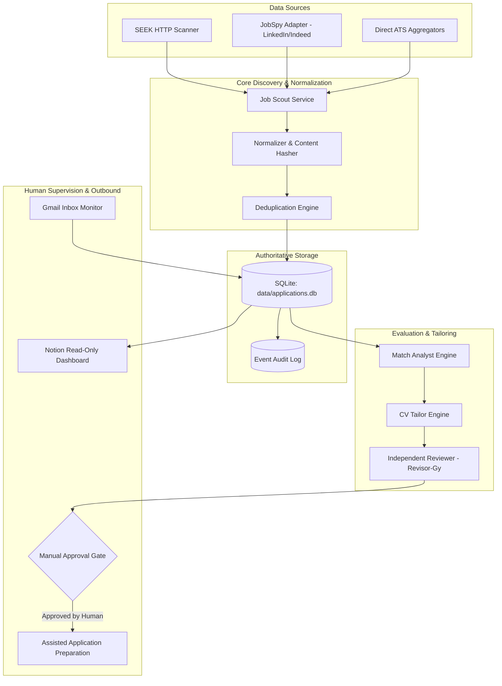

# Australia Job Hunter — Component Dependency Map

```mermaid
graph TD
    subgraph Data Sources
        SEEK[SEEK HTTP Scanner]
        JOBSPY[JobSpy Adapter - LinkedIn/Indeed]
        ATS[Direct ATS Aggregators]
    end

    subgraph Core Discovery & Normalization
        SCOUT[Job Scout Service]
        NORM[Normalizer & Content Hasher]
        DEDUP[Deduplication Engine]
    end

    subgraph Authoritative Storage
        SQLITE[(SQLite: data/applications.db)]
        EVENTS[(Event Audit Log)]
    end

    subgraph Evaluation & Tailoring
        ANALYST[Match Analyst Engine]
        CV_TAILOR[CV Tailor Engine]
        REVISOR[Independent Reviewer - Revisor-Gy]
    end

    subgraph Human Supervision & Outbound
        GATE{Manual Approval Gate}
        NOTION[Notion Read-Only Dashboard]
        GMAIL[Gmail Inbox Monitor]
        PREP[Assisted Application Preparation]
    end

    SEEK --> SCOUT
    JOBSPY --> SCOUT
    ATS --> SCOUT
    SCOUT --> NORM --> DEDUP --> SQLITE
    SQLITE --> EVENTS

    SQLITE --> ANALYST --> CV_TAILOR --> REVISOR
    REVISOR --> GATE
    GATE -->|Approved by Human| PREP
    SQLITE --> NOTION
    GMAIL --> SQLITE
```
